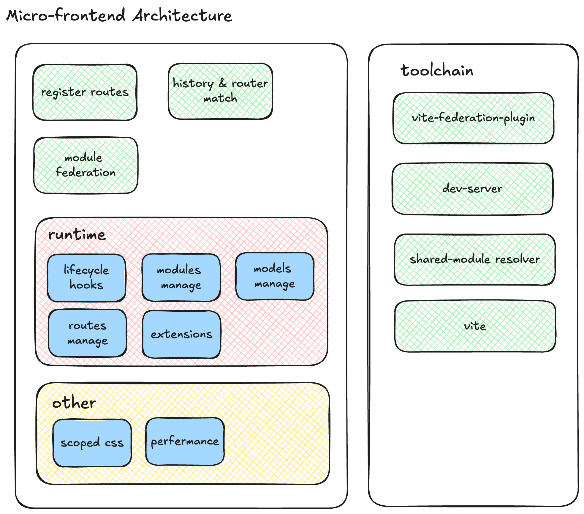

# Micro Frontend Framework: MF-Micro

## Introduction

MF-Micro is a cutting-edge micro frontend framework built on Vite's Module Federation technology. It integrates the power of React and React-Router to provide efficient routing management and modular support for modern web applications. Designed to simplify the implementation of micro frontend architectures, MF-Micro offers a comprehensive solution that includes routing management, module lifecycle management, model management, and a plugin system.

## Core Features

### 1. Module Federation and Routing Management

- **Vite Module Federation Based**: MF-Micro leverages Vite's Module Federation features for efficient code splitting and on-demand loading.
- **React-Router Integration**: Manages routing with React-Router, ensuring smooth navigation within the application.
- **Dynamic Routing Loading**: During application initialization, dynamically fetches routing information configured on the backend and loads the corresponding business modules based on the current URL.

### 2. Runtime Management

- **Lifecycle Management**: Provides precise lifecycle management to ensure modules are loaded, unloaded, and updated at the appropriate times.
- **Module Management**: Covers module loading, unloading, and the reuse of shared modules to optimize resource utilization.
- **Model Management**: Centralizes the management of business module models to ensure data consistency and maintainability.
- **Plugin System**: Constructs a flexible plugin system to support functional extensions.

### 3. CSS Scoping

- **CSS Modules Support**: Utilizes CSS Modules technology to achieve scoped CSS, preventing style conflicts.

### 4. Toolchain

- **Toolchain Support**: Offers a complete set of toolchain support, including build processes, development servers, hot module replacement, etc., to simplify the development process. MF-Micro also integrates `vite-plugin-federation`, optimizes the resolution of public modules such as `lodash`, `lodash-es`, and includes performance optimizations for the development server.

## Architecture

## Contribution

We encourage and welcome contributions from the community, including documentation improvements, bug fixes, and new feature developments. For more details on contributing, please visit the [Contribution Guidelines](https://github.com/LeeeeeeM/vite-mf-micro).

## License

MF-Micro is licensed under the [MIT License](./LICENSE).